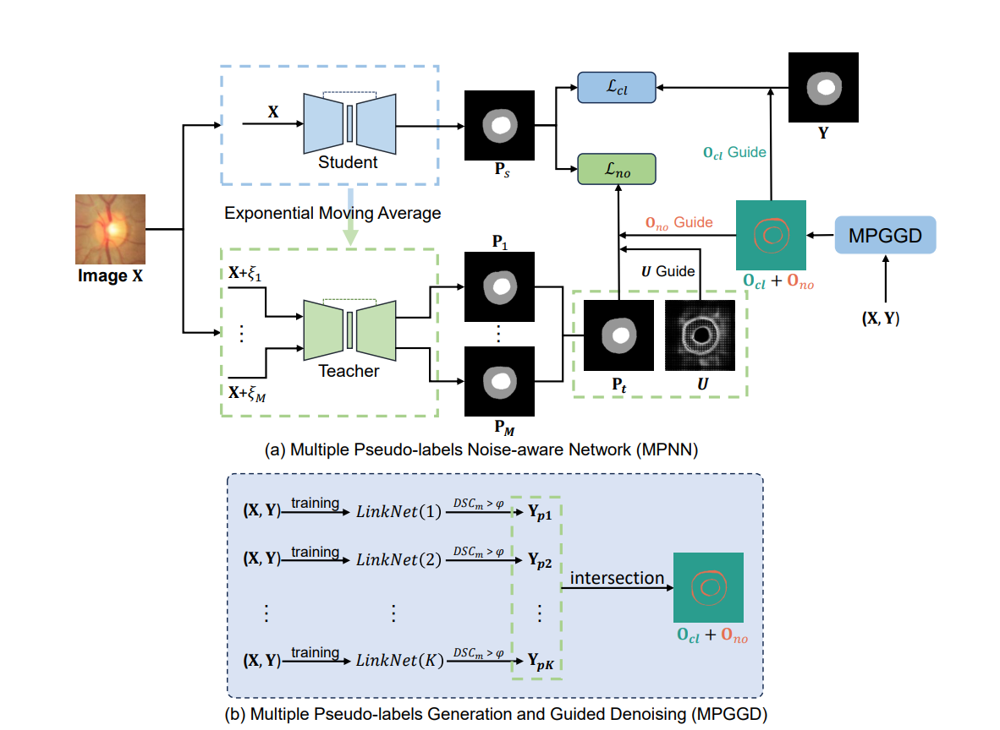

# Multiple Pseudo-labels by Noise-Aware Network(MPNN)



- Implementation of our work Multiple Pseudo-labels by Noise-Aware Network for accurate segmentation of optic disc and cup (CSCWD 2024).

## Multiple Pseudo-labels Generation and Guided Denoising(MPGGD)

```python
python generate_pseudo.py
```

Contains created labels and pseudo-labels. There is no fixed seed when generating pseudo-labels：https://pan.baidu.com/s/1dQFsbQO485AD7csSGxIBQw （the first data is the origin RIGA dataset）

## Training

```
python MPNN.py
```

## Citation

```
@inproceedings{weng2024accurate,
  title={Accurate Segmentation of Optic Disc and Cup from Multiple Pseudo-labels by Noise-aware Learning},
  author={Weng, Tengjin and Shen, Yang and Zhao, Zhidong and Cheng, Zhiming and Wang, Shuai},
  booktitle={2024 27th International Conference on Computer Supported Cooperative Work in Design (CSCWD)},
  pages={1540--1545},
  year={2024},
  organization={IEEE}
}
```

ARXIV:[[2311.18496\] Accurate Segmentation of Optic Disc And Cup from Multiple Pseudo-labels by Noise-Aware Learning (arxiv.org)](https://arxiv.org/abs/2311.18496)
